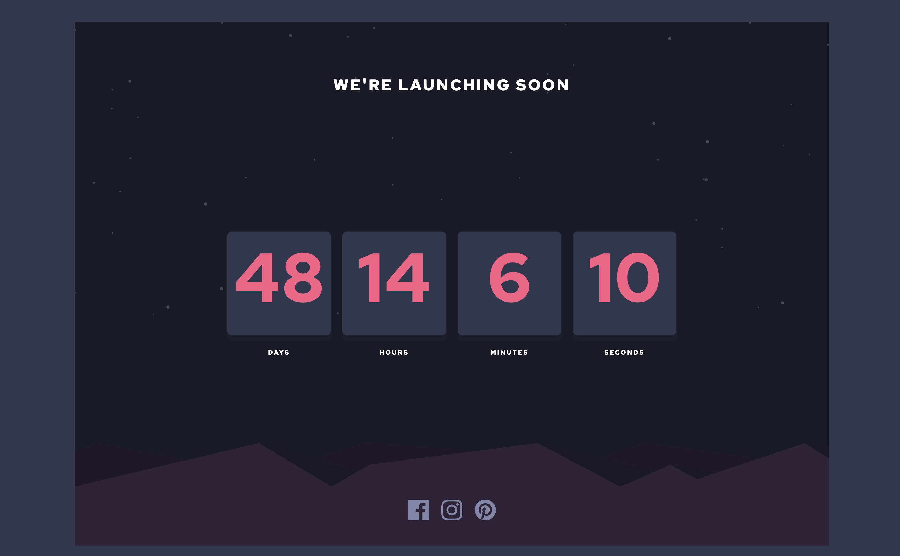

# Frontend Mentor - Launch countdown timer solution

This is a solution to the [Launch countdown timer challenge on Frontend Mentor](https://www.frontendmentor.io/challenges/launch-countdown-timer-N0XkGfyz-). Frontend Mentor challenges help you improve your coding skills by building realistic projects. 

## Table of contents

- [Overview](#overview)
  - [The challenge](#the-challenge)
  - [Screenshot](#screenshot)
  - [Links](#links)
- [My process](#my-process)
  - [Built with](#built-with)
- [Author](#author)

## Overview

### The challenge

Users should be able to:

- See hover states for all interactive elements on the page
- See a live countdown timer that ticks down every second (start the count at 14 days)

### Screenshot

### Links

- Solution URL: [https://github.com/whoiskekeanyway/Launch-countdown-timer](https://github.com/whoiskekeanyway/Launch-countdown-timer)
- Live Site URL: [https://keen-torvalds-a7a200.netlify.app/](https://keen-torvalds-a7a200.netlify.app/)

## My process

### Built with

- Semantic HTML5 markup
- CSS custom properties
- Flexbox
- CSS Grid
- Mobile-first workflow
- Javascript

## Author

- Website - [scriptsandtags.com](https://www.scriptsandtags.com/)
- Frontend Mentor - [@whoiskekeanyway](https://www.frontendmentor.io/profile/whoiskekeanyway)
- Twitter - [@scriptsandtags](https://www.twitter.com/scriptsandtags)

